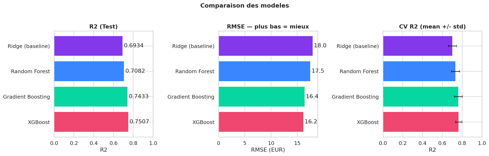
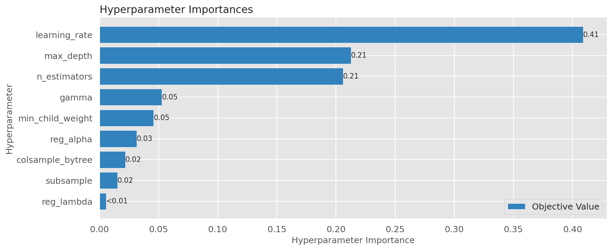
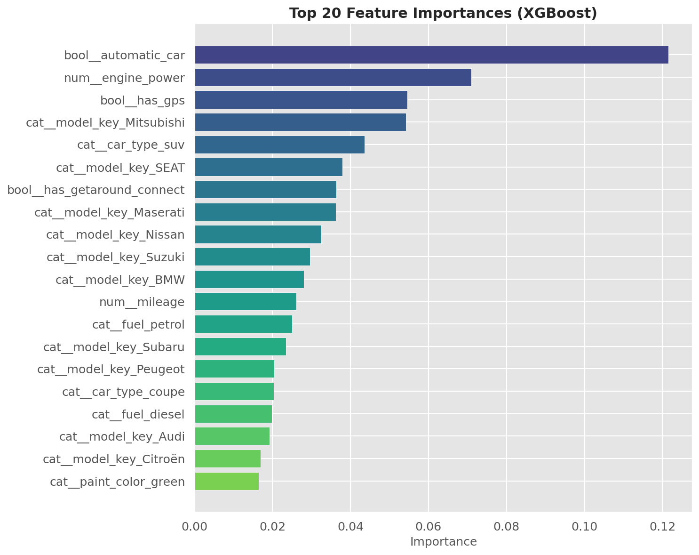
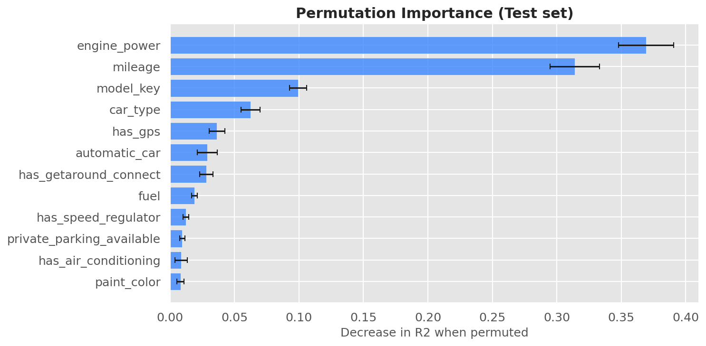
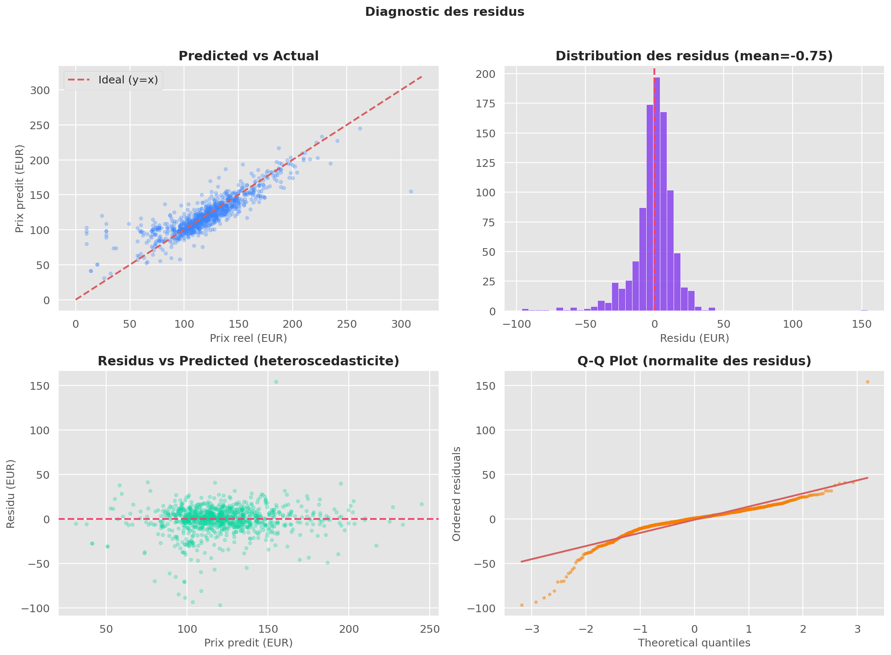
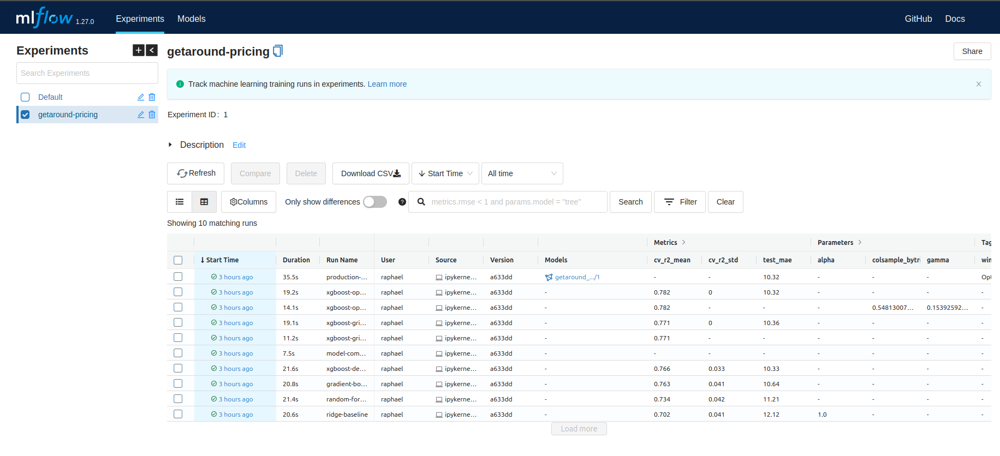
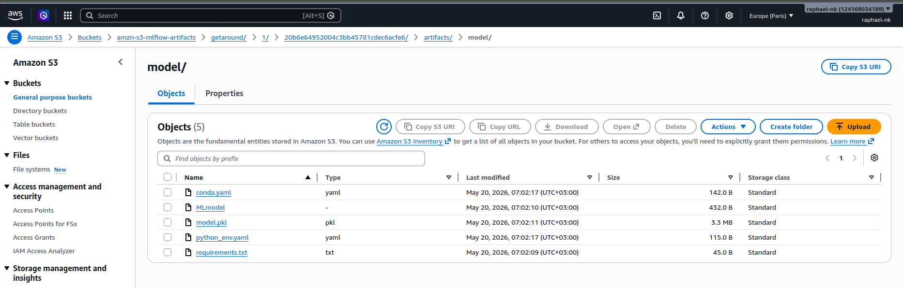

<p align="center">
  
</p>

# Projet GetAround — Analyse des retards et pricing ML

**Bloc 5 — Deployment** · Certification CDSD RNCP35288 - Niveau 6 · [Jedha Bootcamp](https://www.jedha.co/)

## Accès en ligne (production)

> **Pour le jury** — livrables déployés sur Hugging Face Spaces, consultables sans installation :

| Service | URL production | Dépôt |
|---------|----------------|-------|
| **Dashboard** | [raphael-nk-getaround-dashboard.hf.space](https://raphael-nk-getaround-dashboard.hf.space) | [`dashboard/`](dashboard/) → [Space HF](https://huggingface.co/spaces/raphael-nk/getaround-dashboard) |
| **API (Swagger)** | [raphael-nk-getaround-api.hf.space/docs](https://raphael-nk-getaround-api.hf.space/docs) | [`api/`](api/) → [Space HF](https://huggingface.co/spaces/raphael-nk/getaround-api) |
| **MLflow** | [raphael-nk-getaround-mlflow.hf.space](https://raphael-nk-getaround-mlflow.hf.space) | [`mlflow/`](mlflow/) → [Space HF](https://huggingface.co/spaces/raphael-nk/getaround-mlflow) |

---

GetAround est une plateforme de location de voitures entre particuliers. Ce projet répond à deux enjeux data : **analyse des retards de checkout** (délai minimum entre deux locations) et **optimisation des prix journaliers** via Machine Learning. Les livrables ci-dessus sont déployés en production : API FastAPI, dashboard Streamlit et serveur MLflow.

## Objectifs

- Analyser les retards de checkout et quantifier l'impact d'un délai minimum entre locations
- Entraîner un modèle de pricing (XGBoost) pour suggérer un prix journalier optimal
- Déployer une API de prédiction, un dashboard d'analyse et un serveur MLflow en production
- Versionner les expériences ML avec MLflow (tracking + artefacts S3)

## Jeu de données

| Élément | Détail |
|---------|--------|
| Delay Analysis | `data/get_around_delay_analysis.xlsx` |
| Pricing | `data/get_around_pricing_project.csv` |
| Production (dashboard) | `s3://amzn-jedha-39/datasets/getaround/` |

## Structure du projet

Le dépôt principal (monorepo) contient l'analyse et les notebooks. Les trois services en production sont des **submodules Git** pointant vers des Hugging Face Docker Spaces.

```text
projet-getaround-bloc5/
├── api/                          # ◆ submodule — FastAPI pricing
│   ├── main.py
│   ├── models/
│   ├── Dockerfile
│   ├── entrypoint.sh
│   └── requirements.txt
├── dashboard/                    # ◆ submodule — Streamlit
│   ├── main.py
│   ├── sync_data_from_s3.py
│   ├── assets/
│   ├── Dockerfile
│   └── requirements.txt
├── mlflow/                       # ◆ submodule — MLflow server
│   ├── Dockerfile
│   ├── entrypoint.sh
│   └── requirements.txt
├── notebooks/
│   ├── 01_delay_analysis_eda.ipynb
│   ├── 02_pricing_eda_feature_eng.ipynb
│   └── 03_model_training_eval.ipynb
├── data/
│   ├── get_around_delay_analysis.xlsx
│   └── get_around_pricing_project.csv
├── outputs/
│   ├── images/
│   └── models/
├── docs/
│   ├── ARCHITECTURE.md
│   └── JOURNAL.md
├── docker-compose.yml
├── .env.dist
├── .gitmodules
├── .gitignore
├── .python-version
├── pyproject.toml
├── requirements.txt
├── uv.lock
├── LICENSE
└── README.md
```

## Architecture

```text
notebooks/ (EDA + training)
    ↓ export modèle
api/models/ (XGBoost .pkl)  ←  MLflow (tracking + artefacts S3)
    ↓ /predict
dashboard/ (Streamlit)  →  API FastAPI  →  MLflow server
    ↓ sync
S3 (datasets)
```

- Le **notebook 03** entraîne le modèle et le logue dans MLflow
- L'**API** charge le modèle depuis MLflow (run production) ou en fallback local
- Le **dashboard** interroge l'API pour les prédictions et charge les données depuis S3

## API

| Endpoint | Méthode | Description |
|----------|---------|-------------|
| `/` | GET | Infos service |
| `/health` | GET | Statut + source du modèle (`mlflow` ou `local`) |
| `/predict` | POST | Prédiction prix journalier (EUR) |
| `/docs` | GET | Documentation Swagger (OpenAPI) |

### Exemple de requête

```bash
curl -X POST https://raphael-nk-getaround-api.hf.space/predict \
  -H "Content-Type: application/json" \
  -d '{"input":[{"model_key":"Citroën","mileage":50000,"engine_power":90,"fuel":"diesel","paint_color":"black","car_type":"hatchback","private_parking_available":true,"has_gps":true,"has_air_conditioning":true,"automatic_car":false,"has_getaround_connect":true,"has_speed_regulator":true,"winter_tires":false}]}'
```

**Réponse :**

```json
{"prediction": [112.45]}
```

### Python

```python
import requests

response = requests.post(
    "https://raphael-nk-getaround-api.hf.space/predict",
    json={
        "input": [{
            "model_key": "Citroën", "mileage": 50000, "engine_power": 90,
            "fuel": "diesel", "paint_color": "black", "car_type": "hatchback",
            "private_parking_available": True, "has_gps": True,
            "has_air_conditioning": True, "automatic_car": False,
            "has_getaround_connect": True, "has_speed_regulator": True,
            "winter_tires": False,
        }]
    },
)
print(response.json())
```

## Méthodologie ML

### Notebooks

| Notebook | Rôle |
|----------|------|
| `01_delay_analysis_eda.ipynb` | EDA retards, KPIs, recommandations produit |
| `02_pricing_eda_feature_eng.ipynb` | EDA pricing, feature engineering |
| `03_model_training_eval.ipynb` | Entraînement, tuning (GridSearch / Optuna), export modèle, MLflow |

### Résultats

Le notebook 03 exporte :
- `outputs/models/best_pricing_model_xgb.joblib`
- `api/models/best_pricing_model_xgb.pkl`
- `outputs/images/*.png` (figures)
- Run MLflow `production-best-model` (si serveur actif)

#### Comparaison des modèles



Benchmark de plusieurs algorithmes (Linear Regression, Random Forest, XGBoost) sur le prix journalier. XGBoost offre le meilleur compromis biais-variance et est retenu comme modèle de production.

#### Optimisation Optuna



Recherche d'hyperparamètres via Optuna. L'optimisation bayésienne explore efficacement l'espace des paramètres XGBoost et converge vers une configuration performante.

#### Feature importance XGBoost



Les variables les plus influentes sur le prix : `engine_power`, `mileage` et `model_key` dominent. Les équipements (GPS, clim, Connect) ont un impact secondaire mais cumulatif sur la valeur perçue.

#### Permutation importance



Validation de l'importance des features par permutation (indépendante du modèle). Les résultats confirment le classement du feature importance natif : la puissance et le kilométrage sont les premiers déterminants du prix.

#### Diagnostics des résidus



Les résidus sont centrés et homoscédastiques, confirmant la qualité du modèle. Quelques écarts sur les prix extrêmes (véhicules premium ou très anciens) restent dans des marges acceptables.

### Infrastructure cloud

| Capture | Description |
|---------|-------------|
|  | Expérience MLflow `getaround-pricing` — suivi des runs et métriques |
|  | Artefacts modèle stockés sur S3 — versionnés par MLflow |

## Installation locale

### Prérequis

- Python `>= 3.11`
- **Git** avec support submodules
- **Docker** + **Docker Compose** *(optionnel)*
- Données dans `data/` ou accès S3

### Cloner le projet

```bash
git clone --recurse-submodules <url-du-repo>
cd projet-getaround-bloc5
```

Si déjà cloné sans submodules :

```bash
git submodule update --init --recursive
```

### Avec uv (recommandé)

```bash
uv sync
cp .env.dist .env
# Éditer .env
```

### Docker Compose (stack complète)

```bash
cp .env.dist .env
# Éditer .env
docker compose up --build
```

| Service | URL locale |
|---------|-----------|
| MLflow | [http://127.0.0.1:5000](http://127.0.0.1:5000) |
| API (Swagger) | [http://127.0.0.1:8000/docs](http://127.0.0.1:8000/docs) |
| Dashboard | [http://127.0.0.1:8501](http://127.0.0.1:8501) |

## Configuration (`.env`)

Copier `.env.dist` vers `.env` et renseigner :

| Variable | Description |
|----------|-------------|
| `MLFLOW_BACKEND_STORE_URI` | URI Postgres pour le backend MLflow server |
| `MLFLOW_SERVER_URI` | URL HTTP du tracking (prod : `https://raphael-nk-getaround-mlflow.hf.space`, local : `http://127.0.0.1:5000`) |
| `MLFLOW_EXPERIMENT` | Nom de l'expérience (défaut : `getaround-pricing`) |
| `MLFLOW_PRODUCTION_RUN_NAME` | Nom du run production (défaut : `production-best-model`) |
| `ARTIFACT_ROOT` | Racine artefacts MLflow (`s3://...`) |
| `MLFLOW_S3_ENDPOINT_URL` | Endpoint S3 |
| `AWS_ACCESS_KEY_ID` / `AWS_SECRET_ACCESS_KEY` / `AWS_DEFAULT_REGION` | Credentials AWS |
| `GETAROUND_API_URL` | URL de l'API pricing (prod : `https://raphael-nk-getaround-api.hf.space`, local : `http://127.0.0.1:8000`) |
| `GETAROUND_DATA_S3_URI` | Préfixe S3 datasets dashboard (`s3://amzn-jedha-39/datasets/getaround/`) |

> **Docker Compose** : `MLFLOW_SERVER_URI` et `GETAROUND_API_URL` sont surchargés par les hostnames de service (`http://mlflow:5000`, `http://api:8000`).

## Submodules Git

| Dossier | Space Hugging Face | URL production |
|---------|-------------------|----------------|
| `api/` | `raphael-nk/getaround-api` | [raphael-nk-getaround-api.hf.space](https://raphael-nk-getaround-api.hf.space) |
| `dashboard/` | `raphael-nk/getaround-dashboard` | [raphael-nk-getaround-dashboard.hf.space](https://raphael-nk-getaround-dashboard.hf.space) |
| `mlflow/` | `raphael-nk/getaround-mlflow` | [raphael-nk-getaround-mlflow.hf.space](https://raphael-nk-getaround-mlflow.hf.space) |

### Modifier un service déployé

```bash
cd api   # ou dashboard / mlflow
# … éditer, commit …
git push origin main

cd ..
git add api
git commit -m "Bump api submodule"
git push
```

## Stack technique

- **Python 3.11+** · **uv**
- **Pandas** · **scikit-learn** · **XGBoost** · **Optuna** — ML pipeline
- **FastAPI** · **Uvicorn** — API de prédiction
- **Streamlit** — dashboard interactif
- **MLflow 3** — tracking expériences + artefacts S3
- **PostgreSQL** (Neon) · **boto3** — backend MLflow + sync datasets
- **Docker Compose** — stack locale
- **Hugging Face Spaces** (Docker) — déploiement production

## Limites et pistes d'amélioration

### Limites

- Le modèle de pricing est entraîné sur des données historiques statiques
- Le dashboard comporte un fichier `main.py` de ~2 000 lignes qui mériterait un refactoring
- Les Spaces Hugging Face gratuits s'endorment après inactivité (cold start)

### Pistes

- Refactorer le dashboard en modules séparés
- Ajouter un pipeline de réentraînement automatique (MLflow + scheduler)
- Implémenter des tests d'intégration pour l'API
- Enrichir le modèle avec des données externes (saisonnalité, événements locaux)

## Auteur

**RANJAKASOA Raphaël Marcellin**

Projet réalisé dans le cadre du **Bloc 5 — Deployment**, certification **CDSD RNCP35288 - Niveau 6**, [**Jedha Bootcamp**](https://www.jedha.co/).
